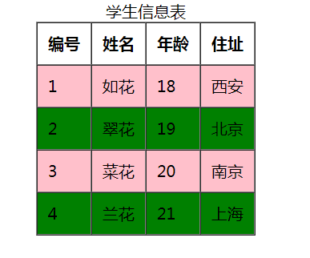
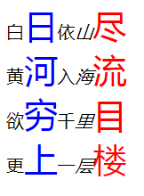

# 知识点

CSS

## 题目1（加强训练）

题干：请认真阅读下列代码，分别使用3种CSS引入方式，把下列代码中p标签的文本内容设置为红色

```html
<!DOCTYPE html>
<html lang="en">
<head>
    <meta charset="UTF-8">
    <title>样式控制</title>
</head>
<body>
    <p>
        CSS(层叠样式表)能够控制HTML元素的展示效果，多个CSS属性可以共同作用于同一个HTML元素上
    </p>
</body>
</html>
```

### 训练目标

掌握CSS三种引入方式的使用

### 训练提示

1. 控制内容颜色的是哪个CSS属性？
2. CSS样式使用分为哪几种？每一种如何书写？

### 操作步骤

1. CSS控制元素内容颜色的属性是 color 属性

2. CSS样式分为以下3种：
   1. 内联样式 ：CSS属性直接写在标签的style属性值中；
   2. 内部样式：CSS属性写在style标签中；
   3. 外部样式：CSS属性写在外部文件中，通过link标签引入；


### 参考答案

内联样式：

```html
<!DOCTYPE html>
<html lang="en">
<head>
    <meta charset="UTF-8">
    <title>样式控制</title>
</head>
<body>
    <p style="color:red">CSS(层叠样式表)能够控制HTML元素的展示效果，多个CSS属性可以共同作用于同一个HTML元素上</p>
</body>
</html>
```

内部样式：

```html
<!DOCTYPE html>
<html lang="en">
<head>
    <meta charset="UTF-8">
    <title>样式控制</title>
    <style>
        p{
            color: red;
        }
    </style>
</head>
<body>
    <p>CSS(层叠样式表)能够控制HTML元素的展示效果，多个CSS属性可以共同作用于同一个HTML元素上</p>
</body>
</html>
```

外部样式：在当前html所在目录下创建 a.css 文件，书写内容为：p{color: red;}，在当前html文档中引入a.css:

```html
<!DOCTYPE html>
<html lang="en">
<head>
    <meta charset="UTF-8">
    <title>样式控制</title>
    <link type="text/css" rel="stylesheet" href="./a.css"/>
</head>
<body>
    <p>CSS(层叠样式表)能够控制HTML元素的展示效果，多个CSS属性可以共同作用于同一个HTML元素上</p>
</body>
</html>
```


## 题目2（加强训练）

题干：请认真阅读下列代码，完成以下需求：

​		1.使用 id选择器设置 "<div>ID选择器</div>"的颜色为蓝色；

​		2.使用类选择器设置“<div>类选择器</div>”的颜色为粉色；

​		3.使用元素选择器设置"<div>元素选择器</div>"的颜色为红色；

```html
<!DOCTYPE html>
<html lang="en">
<head>
    <meta charset="UTF-8">
    <title>样式控制</title>
</head>
<body>
    <div>ID选择器</div>

    <div>类选择器</div>
    <div>类选择器</div>
    <div>类选择器</div>

    <div>元素选择器</div>
    <div>元素选择器</div>
    <div>元素选择器</div>
</body>
</html>
```

### 训练目标

掌握基本选择器的使用

### 训练提示

1.ID选择器的格式？

2.类选择器的格式？

3.元素选择器的格式？

4.控制标签内容颜色的CSS属性？

### 操作步骤

1.ID选择器的格式为：

​	\#id值{属性列表}

2.类选择器的格式为：

​	.类名{属性列表}

3.元素选择器的格式为：

​	元素名{属性列表}

4.控制标签内容颜色的CSS属性为color

### 参考答案

```html
<!DOCTYPE html>
<html lang="en">
<head>
    <meta charset="UTF-8">
    <title>样式控制</title>
    <style>
        #div{
            color: blue;
        }
        .cls{
            color: pink;
        }
        div{
            color: red;
        }

    </style>
</head>
<body>
    <div id="div">ID选择器</div>

    <div class="cls">类选择器</div>
    <div class="cls">类选择器</div>
    <div class="cls">类选择器</div>

    <div>元素选择器</div>
    <div>元素选择器</div>
    <div>元素选择器</div>
</body>
</html>
```


## 题目3（加强训练）

题干：请认真阅读下列代码，分别使用颜色的单词表示方式和16进制表示方式为横线上方和下方的div元素设置指定的颜色

```html
<!DOCTYPE html>
<html lang="en">
<head>
    <meta charset="UTF-8">
    <title>样式控制</title>
    <style>
        /*使用颜色的单词表示方式设置横线上方的div为指定的颜色*/

        /*使用颜色的16进制表示方式设置横线下方的div为指定的颜色*/
    </style>
</head>
<body>
   <div id="blue1">蓝色</div>
   <div id="green1">绿色</div>
   <div id="red1">红色</div>
   <hr/>
   <div id="blue2">蓝色</div>
   <div id="green2">绿色</div>
   <div id="red2">红色</div>
</body>
</html>
```

### 训练目标

掌握CSS颜色属性

### 训练提示

1.控制标签内容颜色的CSS属性？

2.颜色的单词表示方式？

3.颜色的16进制表示方式？

### 操作步骤

1.控制标签内容颜色的CSS属性为color

2.颜色的单词表示方式如： color：red；

3.颜色的16进制表示方式如： color：#000000；

### 参考答案

```html
<!DOCTYPE html>
<html lang="en">
<head>
    <meta charset="UTF-8">
    <title>样式控制</title>
    <style>
        /*使用颜色的单词表示方式设置横线上方的div为指定的颜色*/
        #blue1{
            color:blue;
        }
        #green1{
            color: green;
        }
        #red1{
            color:red;
        }
        /*使用颜色的16进制表示方式设置横线下方的div为指定的颜色*/
        #blue2{
            color: #0000ff;
        }
        #green2{
            color: #00ff00;
        }
        #red2{
            color: #ff0000;
        }
    </style>
</head>
<body>
   <div id="blue1">蓝色</div>
   <div id="green1">绿色</div>
   <div id="red1">红色</div>
   <hr/>
   <div id="blue2">蓝色</div>
   <div id="green2">绿色</div>
   <div id="red2">红色</div>
</body>
</html>
```


## 题目4（加强训练）

题干：请认真阅读下列代码，完成以下需求：

​	1.请设置div1的宽为200px,高为100px，并为div1设置1px的蓝色实线边框*；

​	2.请设置div2的宽为div1宽度的五分之一，高为div1高度的四分之一，并为div2设置1px的红色实线边框

```html
<!DOCTYPE html>
<html lang="en">
<head>
    <meta charset="UTF-8">
    <title>样式控制</title>
    <style>
        /*请设置div1的宽为200px,高为100px，并为div1设置1px的蓝色实线边框*/

        /*请设置div2的宽为div1宽度的五分之一，高为div1高度的四分之一，并为div2设置1px的红色实线边框*/

    </style>
</head>
<body>
   <div id="div1">
       <div id="div2"></div>
   </div>
</body>
</html>
```

### 训练目标

掌握CSS尺寸和边框属性

### 训练提示

1.控制标签边框的CSS属性？

2.宽高属性的两种表示方式？

### 操作步骤

1.控制标签边框的属性是border，使用格式为： border：宽度  线型  颜色;

2.宽高属性有两种表达方式，分别是 像素值和百分比，设置div1可以使用像素值，设置div2可以使用百分比；

### 参考答案

```html
<!DOCTYPE html>
<html lang="en">
<head>
    <meta charset="UTF-8">
    <title>样式控制</title>
    <style>
        /*请设置div1的宽为200px,高为100px，并为div1设置1px的蓝色实线边框*/
        #div1{
            width: 200px;
            height: 100px;
            border: 1px solid blue;
        }
        /*请设置div2的宽为div1宽度的五分之一，高为div1高度的四分之一，并为div2设置1px的红色实线边框*/
        #div2{
            width: 20%;
            height: 25%;
            border: 1px solid red;
        }

    </style>
</head>
<body>
   <div id="div1">
       <div id="div2"></div>
   </div>
</body>
</html>
```


## 题目5（加强训练）

题干：请认真阅读下列代码，完成以下需求：

​	1 请设置div1相关属性：
                宽度： 200px；
                高度： 200px；
                左边框：宽度为1px，线型为实线，颜色为红色;
                上边框：宽度为2px，线型为虚线，颜色为绿色;
                右边框：宽度为1px，线型为实线，颜色为蓝色;
                下边框：宽度为2px，线型为虚线，颜色为黄色;

​	2.请设置div2相关属性：
                宽度：300px；
                高度：100px；
                上下左右边框都是：宽度1px，线型为实线，颜色为绿色;

```html
<!DOCTYPE html>
<html lang="en">
<head>
    <meta charset="UTF-8">
    <title>样式控制</title>
    <style>
        /*
            请设置div1相关属性：
                宽度： 200px；
                高度： 200px；
                左边框：宽度为1px，线型为实线，颜色为红色
                上边框：宽度为2px，线型为虚线，颜色为绿色
                右边框：宽度为1px，线型为实线，颜色为蓝色
                下边框：宽度为2px，线型为虚线，颜色为黄色
        */
        
        /*
            请设置div2相关属性：
                宽度：300px；
                高度：100px；
                上下左右边框都是：宽度1px，线型为实线，颜色为绿色
        */
    </style>
</head>
<body>
   <div class="div1">div1</div>
   <hr/>
   <div class="div2"></div>
</body>
</html>
```

### 训练目标

掌握CSS边框属性

### 训练提示

1.如何分别设置标签的上下左右每个边框？

2.如何一次性设置标签的所有边框为相同的样式？

### 操作步骤

1.如果要分别设置标签的上下左右每个边框，需要使类似于 border-top这样的属性；

2.一次性设置标签的所有边框需要使用复合属性 border ；

### 参考答案

```html
<!DOCTYPE html>
<html lang="en">
<head>
    <meta charset="UTF-8">
    <title>样式控制</title>
    <style>
        /*
            请设置div1相关属性：
                宽度： 200px；
                高度： 200px；
                左边框：宽度为1px，线型为实线，颜色为红色
                上边框：宽度为2px，线型为虚线，颜色为绿色
                右边框：宽度为1px，线型为实线，颜色为蓝色
                下边框：宽度为2px，线型为虚线，颜色为黄色
        */
        .div1{
            width: 200px;
            height: 200px;
            border-left: 1px solid red;
            border-top: 2px dotted green;
            border-right: 1px solid blue;
            border-bottom: 2px dotted yellow;
        }

        /*
            请设置div2相关属性：
                宽度：300px；
                高度：100px；
                上下左右边框都是：宽度1px，线型为实线，颜色为绿色
        */
        .div2{
            width: 300px;
            height: 100px;
            border: 1px solid green;
        }
    </style>
</head>
<body>
   <div class="div1">div1</div>
   <hr/>
   <div class="div2"></div>
</body>
</html>
```


## 题目6（加强训练）

题干：请认真阅读下列代码，通过CSS属性隐藏span2和span4

```html
<!DOCTYPE html>
<html lang="en">
<head>
    <meta charset="UTF-8">
    <title>样式控制</title>
    <style>
       /*请隐藏span2和span4*/
    </style>
</head>
<body>
   <span class="span1">span1</span>
   <span class="span2">span2</span>
   <span class="span3">span3</span>
   <span class="span4">span4</span>
</body>
</html>
```

### 训练目标

掌握CSS隐藏属性

### 训练提示

哪个CSS属性可以控制标签的显示或隐藏?

### 操作步骤

display属性可以控制标签的显示和隐藏，none为隐藏，block为显示。

### 参考答案

```html
<!DOCTYPE html>
<html lang="en">
<head>
    <meta charset="UTF-8">
    <title>样式控制</title>
    <style>
       /*请隐藏span2和span4*/
        .span2,.span4{
            display: none;
        }
    </style>
</head>
<body>
   <span class="span1">span1</span>
   <span class="span2">span2</span>
   <span class="span3">span3</span>
   <span class="span4">span4</span>
</body>
</html>
```


## 题目7（综合案例）

题干：请认真阅读下列代码，通过CSS实现如下效果：

​	

```html
<!DOCTYPE html>
<html lang="en">
<head>
    <meta charset="UTF-8">
    <title>样式控制</title>
    <style>
        /*请补全CSS代码，实现隔行变色的效果*/

    </style>
</head>
<body>
   <table>
       <caption>学生信息表</caption>
       <tr>
           <th>编号</th>
           <th>姓名</th>
           <th>年龄</th>
           <th>住址</th>
       </tr>
       <tr class="pink">
           <td>1</td>
           <td>如花</td>
           <td>18</td>
           <td>西安</td>
       </tr>
       <tr class="green">
           <td>2</td>
           <td>翠花</td>
           <td>19</td>
           <td>北京</td>
       </tr>
       <tr class="pink">
           <td>3</td>
           <td>菜花</td>
           <td>20</td>
           <td>南京</td>
       </tr>
       <tr class="green">
           <td>4</td>
           <td>兰花</td>
           <td>21</td>
           <td>上海</td>
       </tr>
   </table>
</body>
</html>
```

### 训练目标

掌握table表格边框设置、元素背景色设置、类选择器和元素选择器

### 训练提示

1.如何设置table的边框?如何让边框显示为一条实线？

2.如何设置元素背景色？

3.如何设置单元格的内边距？

### 操作步骤

1.在table标签上设置border属性来设置边框，再通过cellspacing和cellpadding属性让边框显示为一条实线；

2.隔行变换颜色，给tr设置backgroundColor属性设置背景色；

3.单元格内容和边框之间有间距，通过padding属性可以设置适当的边距；

### 参考答案

```html
<!DOCTYPE html>
<html lang="en">
<head>
    <meta charset="UTF-8">
    <title>样式控制</title>
    <style>

        .pink{
            background-color: pink;
        }
        .green{
            background-color: green;
        }

        td,th{
            padding: 10px;
        }

    </style>
</head>
<body>
   <table border="1px" cellspacing="0" cellpadding="0" align="center">
       <caption>学生信息表</caption>
       <tr>
           <th>编号</th>
           <th>姓名</th>
           <th>年龄</th>
           <th>住址</th>
       </tr>
       <tr class="pink">
           <td>1</td>
           <td>如花</td>
           <td>18</td>
           <td>西安</td>
       </tr>
       <tr class="green">
           <td>2</td>
           <td>翠花</td>
           <td>19</td>
           <td>北京</td>
       </tr>
       <tr class="pink">
           <td>3</td>
           <td>菜花</td>
           <td>20</td>
           <td>南京</td>
       </tr>
       <tr class="green">
           <td>4</td>
           <td>兰花</td>
           <td>21</td>
           <td>上海</td>
       </tr>
   </table>
</body>
</html>
```


## 题目8（综合案例）

题干：请认真阅读下列代码，实现如下效果：

​	

```html
<!DOCTYPE html>
<html lang="en">
<head>
    <meta charset="UTF-8">
    <title>样式控制</title>
    <style>
		/*请通过css实现字体变换的效果*/

    </style>
</head>
<body>
   <div>
       白日依山尽<br/>
       黄河入海流<br/>
       欲穷千里目<br/>
       更上一层楼
   </div>
</body>
</html>
```

### 训练目标

掌握字体相关的CSS属性及html标签

### 训练提示

1.如何才能给指定的字设置不同的属性？

2.如何设置字体的大小？

3.如何设置字体的颜色？

4.如何设置斜体？

### 操作步骤

1.要给不同的字设置不同的样式，可以使用span等标签把具体的字包裹起来，然后再通过选择器给不同的span设置不同CSS样式；

2.通过CSS属性 font-size可以设置字体的大小

3.通过CSS属性 color可以设置字体的颜色

4.把要变为斜体的字用<i>标签包裹，被包裹的字就可以变为斜体

### 参考答案

```html
<!DOCTYPE html>
<html lang="en">
<head>
    <meta charset="UTF-8">
    <title>样式控制</title>
    <style>
        .cls1{
            font-size: 30px;
            color:blue;
        }
        .cls2{
            font-size: 30px;
            color: red;
        }

    </style>
</head>
<body>
   <div>
       白<span class="cls1">日</span>依<i>山</i><span class="cls2">尽</span><br/>
       黄<span class="cls1">河</span>入<i>海</i><span class="cls2">流</span><br/>
       欲<span class="cls1">穷</span>千<i>里</i><span class="cls2">目</span><br/>
       更<span class="cls1">上</span>一<i>层</i><span class="cls2">楼</span>
   </div>
</body>
</html>

```


